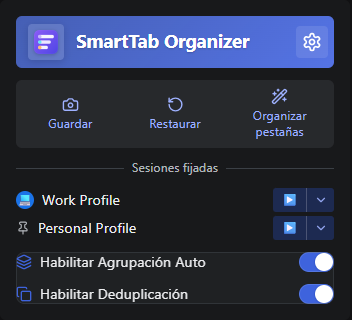
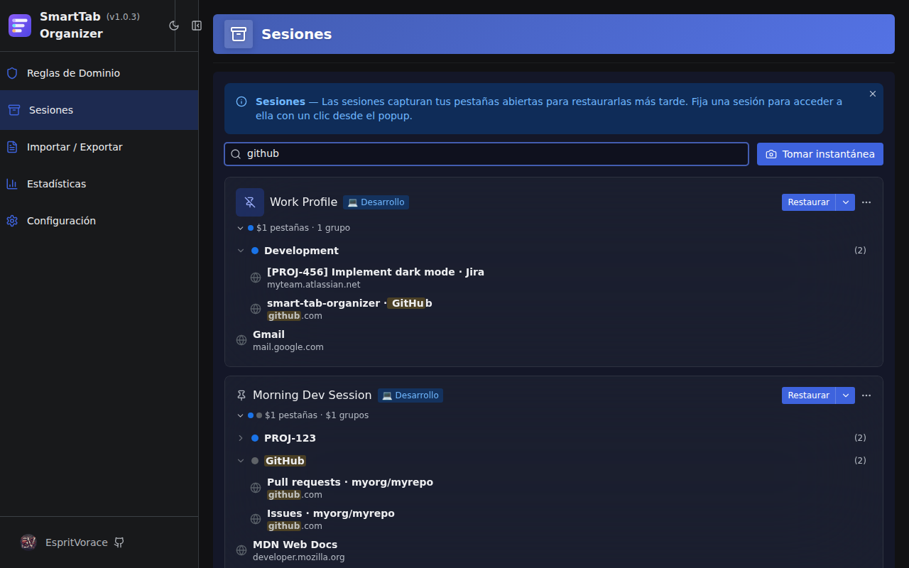
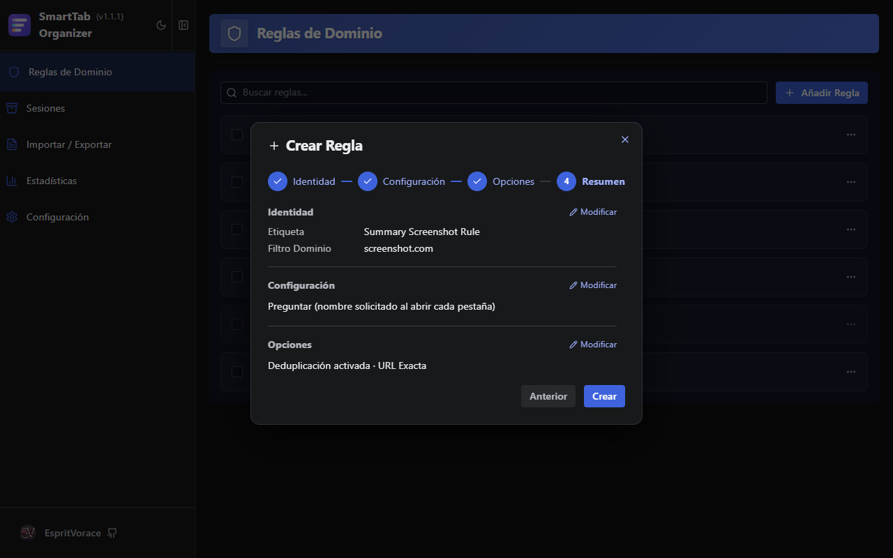

[](https://github.com/EspritVorace/smart-tab-organizer/blob/main/README.md)
[](https://github.com/EspritVorace/smart-tab-organizer/blob/main/README-fr.md)
[](https://github.com/EspritVorace/smart-tab-organizer/blob/main/README-es.md)

# SmartTab Organizer


**SmartTab Organizer** es una extensión multinavegador que agrupa automáticamente las pestañas relacionadas, evita duplicados y guarda tus espacios de trabajo como sesiones con nombre.

<p align="center">
  
</p>

## Características

### 🗂️ Agrupación Automática

Clic central o clic derecho → "Abrir en una pestaña nueva" en un sitio configurado, y la pestaña aterriza al instante en el grupo correcto.

- Nombre del grupo extraído del título de la página, la URL o un preajuste regex
- Preajustes integrados para Jira, GitLab, GitHub, Trello y más

<p align="center">
  
</p>

### 🔁 Deduplicación

Abrir una página que ya está abierta reactiva y recarga la pestaña existente en lugar de crear una nueva.
La sensibilidad de coincidencia es configurable por regla: URL exacta, nombre de host + ruta, nombre de host o "includes".

### 📷 Sesiones

Guarda un snapshot con nombre de tus pestañas y grupos abiertos, y restáuralOs cuando los necesites.

- **Sesiones ancladas** — convierte cualquier snapshot en acceso rápido desde el popup, con un icono personalizado
- **Asistente de restauración** — elige qué pestañas recuperar, la ventana de destino y resuelve conflictos de grupos antes de aplicar
- **Búsqueda profunda** — encuentra pestañas y grupos por nombre en todas tus sesiones guardadas
- **Editor de sesión** — reorganiza, renombra y elimina pestañas y grupos sin necesidad de restaurar

<p align="center">
  
</p>

<p align="center">
  
</p>

### ⚙️ Gestión de Reglas

Las reglas de dominio se crean mediante un asistente guiado de 4 pasos: identidad → modo de nombrado → opciones → resumen.

Tres modos de nombrado de grupo:
- **Preajuste** — elige un patrón regex integrado o personalizado (IDs de tickets Jira, nombres de repos de GitHub…)
- **Preguntar** — solicita un nombre cuando se abre la pestaña
- **Manual** — nombre de grupo fijo

<p align="center">
  
</p>

Un **asistente de importación/exportación** clasifica las reglas entrantes como nuevas, en conflicto o idénticas, y resuelve los conflictos paso a paso.

<p align="center">
  
</p>

### ⚡ Popup de Acceso Rápido

- Activa/desactiva globalmente la agrupación y la deduplicación
- Toma un snapshot o accede a Sesiones con un clic
- Sesiones ancladas listadas con acciones de restauración rápida

### ♿ Accesibilidad e i18n

Navegación completa por teclado y soporte para lectores de pantalla mediante primitivas Radix UI. Disponible en Inglés, Francés y Español.

## Instalación

```bash
git clone https://github.com/EspritVorace/smart-tab-organizer.git
cd smart-tab-organizer
npm install -g pnpm  # si es necesario
pnpm install
pnpm build
```

- **Chrome:** `chrome://extensions/` → Cargar descomprimida → `.output/chrome-mv3`
- **Firefox:** `about:debugging` → Cargar complemento temporal → `.output/firefox-mv2/manifest.json`

Para desarrollo con recarga automática: `pnpm dev` (Chrome) o `pnpm dev:firefox`.

## Stack Tecnológico

WXT · React + TypeScript · Radix UI Themes · Zod · Vitest · Playwright

## Licencia

GNU General Public License v3.0
