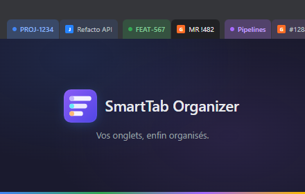
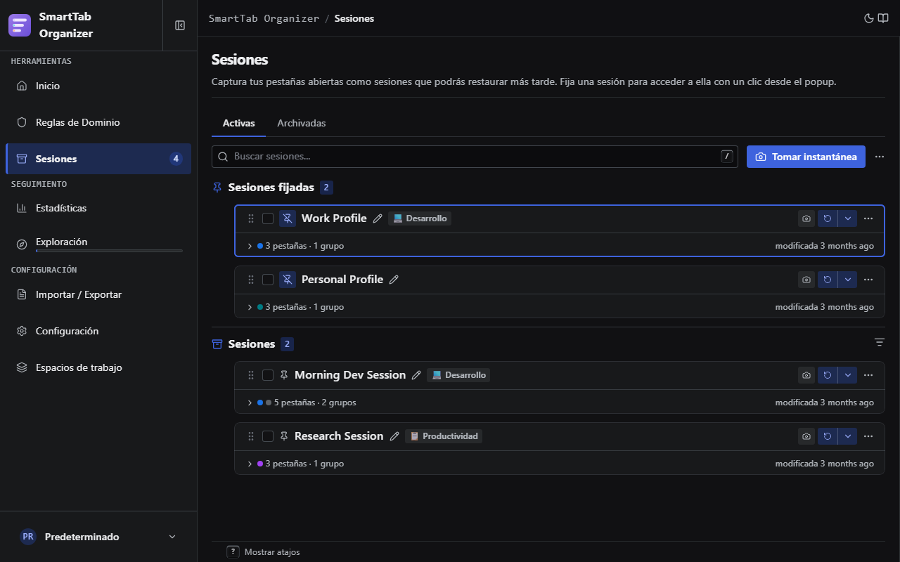

[](https://github.com/EspritVorace/smart-tab-organizer/blob/main/README.md)
[](https://github.com/EspritVorace/smart-tab-organizer/blob/main/README-fr.md)
[](https://github.com/EspritVorace/smart-tab-organizer/blob/main/README-es.md)

# SmartTab Organizer

> **Doma tus pestañas. Sin nube, sin IA, sin tracking.**

Una extensión para Chrome y Firefox que agrupa tus pestañas por dominio, elimina los duplicados y captura tus espacios de trabajo como sesiones que puedes restaurar con un clic.

<p align="center">
  
</p>

<p align="center">
  <a href="https://chromewebstore.google.com/detail/smarttab-organizer/ijnpdkkcbmfikocmboibffjgbohhlmah">
    
  </a>
  <a href="https://addons.mozilla.org/firefox/addon/smarttab-organizer/">
    
  </a>
  
</p>

## ¿Por qué?

- Tus pestañas se acumulan más rápido de lo que las cierras. SmartTab las pone en su sitio, automáticamente.
- Las otras herramientas envían tus datos a la nube o meten IA por todas partes. Aquí, todo se queda en tu navegador, cero telemetría.
- El espacio de trabajo que has montado merece volver mañana. Guárdalo, ponle nombre, restáuralo.

## Lo que hace

### 🗂️ Agrupación automática por dominio

Abres un ticket de Jira, una PR de GitHub, una página de docs : la nueva pestaña aterriza al instante en el grupo correcto. El nombre del grupo viene del título de la página, de la URL, o de un preajuste regex (Jira, GitHub, GitLab, Trello, y muchos más).

<p align="center">
  
</p>

### 🔁 Deduplicación

¿Abres una página que ya estaba abierta ? El duplicado desaparece. El modo de comparación se ajusta por regla (URL exacta, "contiene", o "ignora estos parámetros"), y tú eliges cuál de las dos pestañas sobrevive.

<p align="center">
  
</p>

### 📷 Sesiones que de verdad usarás

Captura tus pestañas y grupos abiertos, ponles nombre, fija las que más usas. Restaura en la ventana actual, en una nueva, o reemplaza lo que tienes. Cada sesión es editable, buscable hasta el nivel de pestaña, y puede llevar tus propias notas.

<p align="center">
  
</p>

## Y además

- **Espacios de trabajo** : reglas, sesiones y estadísticas separadas por contexto (trabajo, personal, side project)
- **20+ packs de reglas** listos para importar para herramientas populares (GitHub, GitLab, Jira, AWS, asistentes de IA, Discord...)
- **Importar / exportar** con resolución de conflictos para reglas y sesiones
- **Estadísticas locales** : ve cuántas agrupaciones y deduplicaciones te ahorran tiempo
- **Atajos de teclado** con panel de ayuda integrado
- **Tema claro / oscuro / sistema**
- **Accesibilidad primero** : auditado con axe-core, navegación por teclado, compatible con lectores de pantalla
- **3 idiomas** : inglés, francés, español

## 📖 Documentación

Guía completa en línea : [docs.esprit-vorace.fr](https://docs.esprit-vorace.fr/es/) (Astro Starlight, 3 idiomas, más de 30 páginas con capturas). Las fuentes MDX están en [`docs/`](docs/src/content/docs/es/) para los contribuidores.

## 🛠️ Para contribuir

**Requisitos :** Node.js, [pnpm](https://pnpm.io/)

```bash
pnpm install
pnpm dev          # Chrome con auto-recarga
pnpm dev:firefox  # Firefox con auto-recarga
pnpm test         # Tests unitarios Vitest
pnpm test:e2e     # Tests E2E Playwright
pnpm storybook    # Explorador de componentes (puerto 6006)
pnpm build        # Build de producción
```

El stack (WXT, React 19, Radix UI, Zod, Vitest, Playwright, Storybook) y las convenciones de código están documentadas en [`CLAUDE.md`](CLAUDE.md) y el [anexo stack técnico](docs/src/content/docs/annexes/stack-technique.mdx).

Por favor, abre una issue antes de enviar una pull request grande.

## 📜 Licencia

GNU General Public License v3.0.
