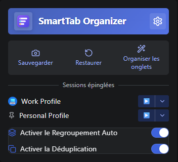
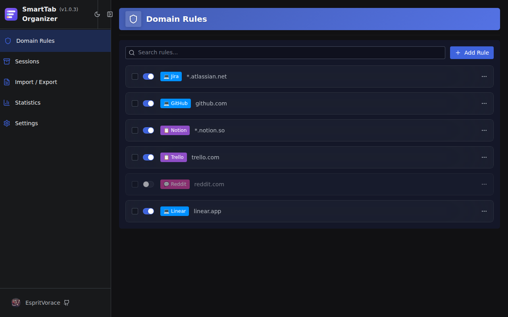
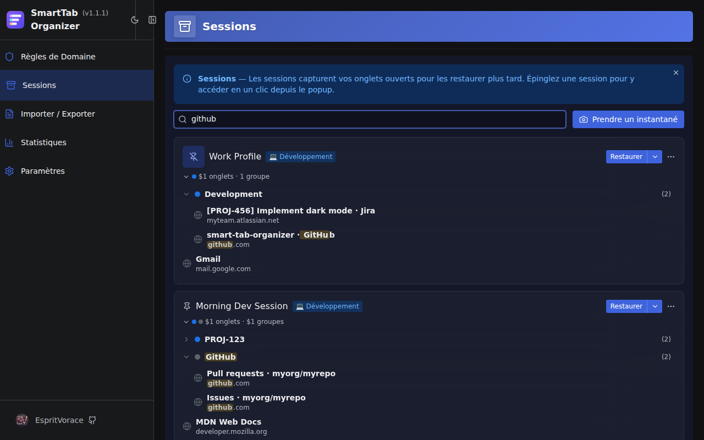
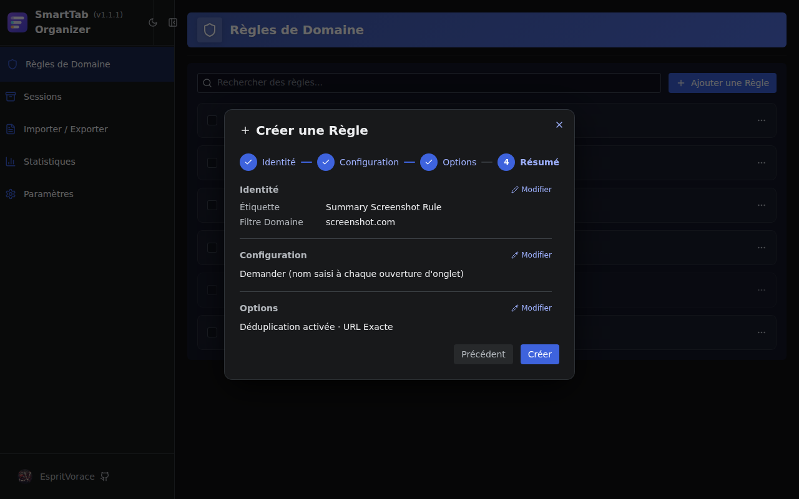

[](https://github.com/EspritVorace/smart-tab-organizer/blob/main/README.md)
[](https://github.com/EspritVorace/smart-tab-organizer/blob/main/README-fr.md)
[](https://github.com/EspritVorace/smart-tab-organizer/blob/main/README-es.md)

# SmartTab Organizer


**SmartTab Organizer** est une extension multi-navigateur qui regroupe automatiquement les onglets liés, évite les doublons et sauvegarde vos espaces de travail sous forme de sessions nommées.

<p align="center">
  
</p>

## Fonctionnalités

### 🗂️ Regroupement Automatique

Clic molette ou clic droit → "Ouvrir dans un nouvel onglet" sur un site configuré, et l'onglet rejoint instantanément le bon groupe.

- Nom du groupe extrait du titre de la page, de l'URL ou d'un préréglage regex
- Préréglages intégrés pour Jira, GitLab, GitHub, Trello et plus encore

<p align="center">
  
</p>

### 🔁 Déduplication

Ouvrir une page déjà ouverte remet l'onglet existant au premier plan et le recharge.
La sensibilité de correspondance est configurable par règle : URL exacte, nom d'hôte + chemin, nom d'hôte ou « includes ».

### 📷 Sessions

Sauvegardez un snapshot nommé de vos onglets et groupes ouverts, et restaurez-les quand vous en avez besoin.

- **Sessions épinglées** — promouvez un snapshot dans le popup pour un accès en un clic, avec une icône personnalisée
- **Assistant de restauration** — choisissez les onglets à récupérer, la fenêtre cible, et résolvez les conflits de groupes avant d'appliquer
- **Recherche profonde** — retrouvez onglets et groupes par nom dans toutes vos sessions sauvegardées
- **Éditeur de session** — réorganisez, renommez et supprimez onglets et groupes sans avoir à restaurer

<p align="center">
  
</p>

<p align="center">
  
</p>

### ⚙️ Gestion des Règles

Les règles de domaine sont créées via un assistant guidé en 4 étapes : identité → mode de nommage → options → récapitulatif.

Trois modes de nommage de groupe :
- **Préréglage** — choisissez un motif regex intégré ou personnalisé (numéros de tickets Jira, noms de dépôts GitHub…)
- **Demander** — prompt pour saisir un nom à l'ouverture de l'onglet
- **Manuel** — nom de groupe fixe

<p align="center">
  
</p>

Un **assistant d'import/export** classe les règles entrantes en nouvelles, en conflit ou identiques, et résout les conflits pas à pas.

<p align="center">
  
</p>

### ⚡ Popup d'Accès Rapide

- Activez/désactivez globalement le regroupement et la déduplication
- Prenez un snapshot ou accédez aux Sessions en un clic
- Sessions épinglées listées avec des actions de restauration rapide

### ♿ Accessibilité & i18n

Navigation complète au clavier et support des lecteurs d'écran via les primitives Radix UI. Disponible en Anglais, Français et Espagnol.

## Installation

```bash
git clone https://github.com/EspritVorace/smart-tab-organizer.git
cd smart-tab-organizer
npm install -g pnpm  # si nécessaire
pnpm install
pnpm build
```

- **Chrome :** `chrome://extensions/` → Charger l'extension non empaquetée → `.output/chrome-mv3`
- **Firefox :** `about:debugging` → Charger un module complémentaire temporaire → `.output/firefox-mv2/manifest.json`

Pour le développement avec rechargement automatique : `pnpm dev` (Chrome) ou `pnpm dev:firefox`.

## Stack Technique

WXT · React + TypeScript · Radix UI Themes · Zod · Vitest · Playwright

## Licence

GNU General Public License v3.0
