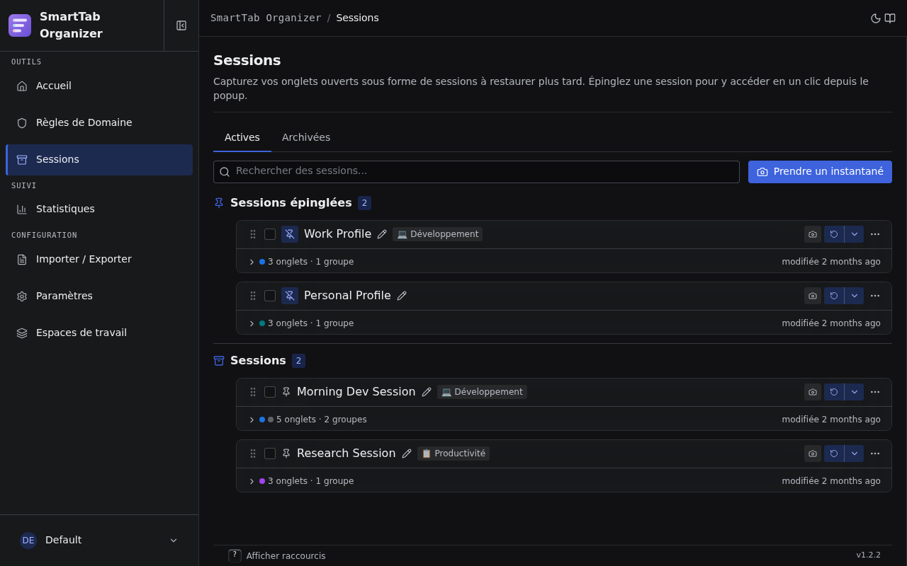

[](https://github.com/EspritVorace/smart-tab-organizer/blob/main/README.md)
[](https://github.com/EspritVorace/smart-tab-organizer/blob/main/README-fr.md)
[](https://github.com/EspritVorace/smart-tab-organizer/blob/main/README-es.md)

# SmartTab Organizer

> **Tes onglets se rangent et se nomment tout seuls. Sans cloud, sans tracking.**

SmartTab Organizer lit le nom du groupe directement dans l'URL ou le titre : un groupe par dépôt, par ticket ou par client se crée tout seul, sans multiplier une règle par valeur. Tout reste dans ton navigateur : sans cloud, sans IA, sans tracking. L'extension supprime aussi les onglets en doublon et capture tes espaces de travail sous forme de sessions à restaurer en un clic. [Voir en images](https://docs.esprit-vorace.fr/fr/).

<p align="center">
  
</p>

<p align="center">
  <a href="https://chromewebstore.google.com/detail/smarttab-organizer/ijnpdkkcbmfikocmboibffjgbohhlmah">
    
  </a>
  <a href="https://addons.mozilla.org/firefox/addon/smarttab-organizer/">
    
  </a>
  
</p>

## Pourquoi ?

- Les autres extensions t'obligent à saisir un nom de groupe fixe, une règle par valeur. SmartTab l'extrait de l'URL ou du titre : un groupe par dépôt, par ticket ou par client apparaît tout seul, sans multiplier les règles.
- Sans cloud, sans IA, sans télémétrie. Tout tourne dans ton navigateur et tes données n'en sortent jamais.
- L'espace de travail que tu as monté mérite de revenir demain. Sauvegarde-le, nomme-le, restaure-le.

## Ce que ça fait

### 🗂️ Regroupement automatique par domaine

Tu ouvres un ticket Jira, une PR GitHub, une page de docs : le nouvel onglet atterrit dans le bon groupe instantanément. Le nom du groupe vient du titre de la page, de l'URL, ou d'un préréglage regex (Jira, GitHub, GitLab, Trello, et bien d'autres).

<p align="center">
  
</p>

### 🔁 Déduplication

Tu ouvres une page déjà ouverte ? Le doublon disparaît. Le mode de comparaison se règle par règle (URL exacte, "contient", ou "ignore ces paramètres"), et tu choisis lequel des deux onglets survit.

<p align="center">
  
</p>

### 📷 Des sessions vraiment utilisables

Capture tes onglets et tes groupes ouverts, nomme-les, épingle ceux dans lesquels tu vis. Restaure dans la fenêtre courante, dans une nouvelle, ou remplace ce que tu as. Chaque session est éditable, cherchable jusqu'au niveau des onglets, et peut porter tes propres notes.

<p align="center">
  
</p>

## Et aussi

- **Espaces de travail** : règles, sessions et stats séparés par contexte (pro, perso, projet annexe)
- **49 packs de règles** prêts à importer pour les outils courants (GitHub, GitLab, Jira, AWS, assistants IA, Discord...)
- **Import / export** avec résolution de conflits pour les règles comme pour les sessions
- **Statistiques locales** : vois combien de regroupements et de déduplications te font gagner du temps
- **Raccourcis clavier** avec panneau d'aide intégré
- **Thème clair / sombre / système**
- **Accessibilité d'abord** : audité par axe-core, navigation clavier, compatible lecteurs d'écran
- **3 langues** : français, anglais, espagnol

## 📖 Documentation

Guide complet en ligne : [docs.esprit-vorace.fr](https://docs.esprit-vorace.fr/fr/) (Astro Starlight, 3 langues, plus de 30 pages avec captures). Les sources MDX sont dans [`docs/`](docs/src/content/docs/fr/) pour les contributeurs.

## 🛠️ Pour les contributeurs

**Prérequis :** Node.js, [pnpm](https://pnpm.io/)

```bash
pnpm install
pnpm dev          # Chrome avec rechargement auto
pnpm dev:firefox  # Firefox avec rechargement auto
pnpm test         # Tests unitaires Vitest
pnpm test:e2e     # Tests E2E Playwright
pnpm storybook    # Explorateur de composants (port 6006)
pnpm build        # Build production
```

La stack (WXT, React 19, Radix UI, Zod, Vitest, Playwright, Storybook) et les conventions de code sont documentées dans [`CLAUDE.md`](CLAUDE.md) et l'[annexe stack technique](docs/src/content/docs/fr/contributing/stack.mdx).

Merci d'ouvrir une issue avant de soumettre une pull request importante.

## 📜 Licence

GNU General Public License v3.0.

## 🗝️ Licences tierces

SmartTab Organizer embarque des composants open source (React, Radix UI, Lucide, Zod, CodeMirror, dnd-kit et d'autres). Leurs mentions de copyright et textes de licence complets sont listés dans [THIRD-PARTY-LICENSES.txt](THIRD-PARTY-LICENSES.txt) et sur la [page d'attribution](https://docs.esprit-vorace.fr/fr/reference/open-source-licenses/).
