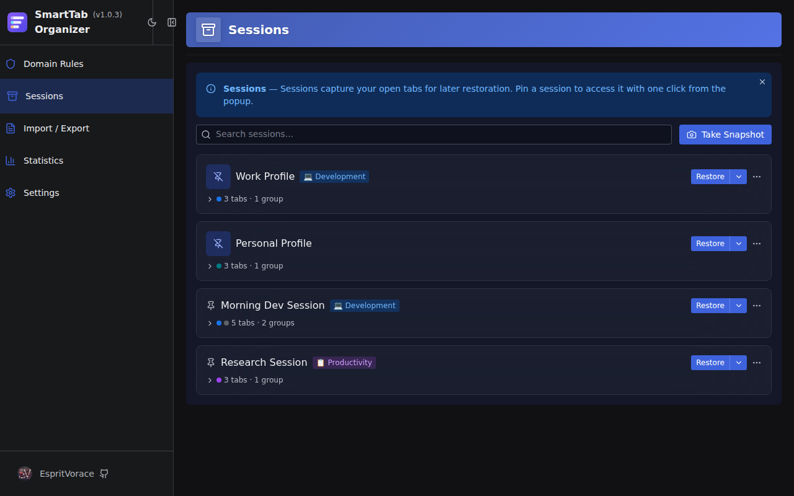
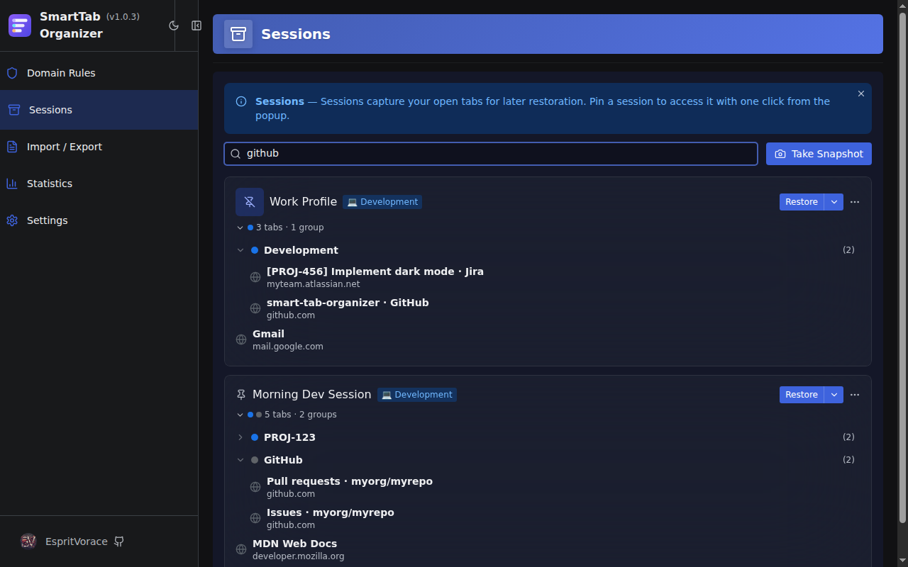
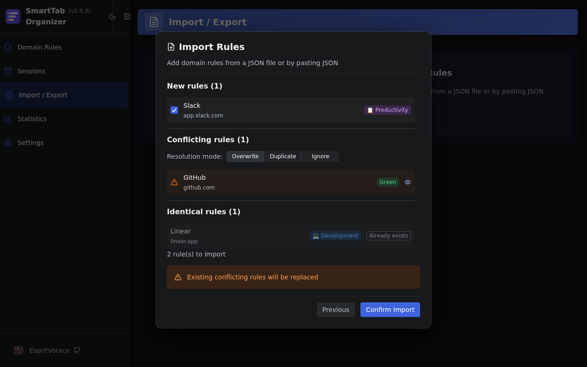
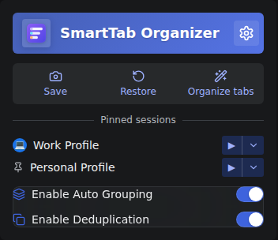

[](https://github.com/EspritVorace/smart-tab-organizer/blob/main/README.md)
[](https://github.com/EspritVorace/smart-tab-organizer/blob/main/README-fr.md)
[](https://github.com/EspritVorace/smart-tab-organizer/blob/main/README-es.md)

# SmartTab Organizer


**SmartTab Organizer** is a cross-browser extension that automatically groups related tabs, prevents duplicates, and saves your workspaces as named sessions.

<p align="center">
  
</p>

## 🛒 Chrome Web Store ##


[](https://chromewebstore.google.com/detail/smarttab-organizer/ijnpdkkcbmfikocmboibffjgbohhlmah)

## Features

### ⚙️ Rule Management

Domain rules are created through a guided 4-step wizard: identity → group naming mode → options → summary.

Three group naming modes:
- **Preset** — pick a built-in or custom regex pattern (Jira ticket IDs, GitHub repo names…)
- **Ask** — prompt for a name when the tab opens
- **Manual** — fixed group name

<p align="center">
  
</p>

### 🗂️ Automatic Grouping

Middle-click or right-click → "Open in new tab" on a configured site and the tab lands in the right group instantly.

- Group names extracted from the page title, URL, or a regex preset
- Built-in presets for Jira, GitLab, GitHub, Trello and more

<p align="center">
  
</p>

### 🔁 Deduplication

Opening a page that's already open refocuses and reloads the existing tab instead.
Matching sensitivity is configurable per rule: exact URL, hostname + path, hostname, or "includes".

<p align="center">
  
</p>


### 📷 Sessions

Save a named snapshot of your open tabs and groups, restore them whenever you need.

- **Pinned sessions** — promote any snapshot to your popup for one-click access, with a custom icon
- **Restore wizard** — pick which tabs to bring back, choose the target window, resolve group conflicts before applying
- **Deep search** — find tabs and groups by name across all your saved sessions
- **Session editor** — reorganize, rename and delete tabs and groups without restoring first

<p align="center">
  
</p>

<p align="center">
  
</p>


An **Import/Export wizard for Rules and Sessions** classifies incoming as new, conflicting or identical, and resolves conflicts step by step.

<p align="center">
  
</p>

### ⚡ Quick Access Popup

- Toggle grouping and deduplication globally
- Take a snapshot or jump to Sessions in one click
- Pinned sessions listed with quick-restore actions

<p align="center">


</p>

### ♿ Accessibility & i18n

Full keyboard navigation and screen-reader support via Radix UI primitives. Available in English, French and Spanish.

## 💻 Installation

```bash
git clone https://github.com/EspritVorace/smart-tab-organizer.git
cd smart-tab-organizer
npm install -g pnpm  # if needed
pnpm install
pnpm build
```

- **Chrome:** `chrome://extensions/` → Load unpacked → `.output/chrome-mv3`

For development with auto-reload: `pnpm dev` (Chrome) or `pnpm dev:firefox`.

## 🛠️ Tech Stack

WXT · React + TypeScript · Radix UI Themes · Zod · Vitest · Playwright

## 📜 License

GNU General Public License v3.0
