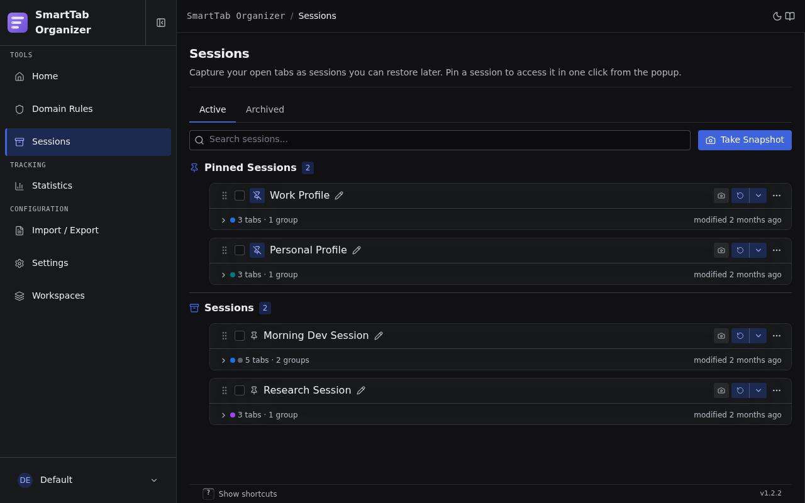

[](https://github.com/EspritVorace/smart-tab-organizer/blob/main/README.md)
[](https://github.com/EspritVorace/smart-tab-organizer/blob/main/README-fr.md)
[](https://github.com/EspritVorace/smart-tab-organizer/blob/main/README-es.md)

# SmartTab Organizer

> **Tame your tabs. No cloud, no AI, no tracking.**

A Chrome and Firefox extension that groups your tabs by domain, kills duplicates, and snapshots your workspaces as sessions you can restore in one click.

<p align="center">
  
</p>

<p align="center">
  <a href="https://chromewebstore.google.com/detail/smarttab-organizer/ijnpdkkcbmfikocmboibffjgbohhlmah">
    
  </a>
  <a href="https://addons.mozilla.org/firefox/addon/smarttab-organizer/">
    
  </a>
  
</p>

## Why?

- Your tabs pile up faster than you can close them. SmartTab puts them in their place, automatically.
- Other tools either ship your data to a cloud or shove AI in your face. This one runs entirely in your browser, with zero telemetry.
- The workspace you built deserves to come back tomorrow. Save it, name it, restore it.

## What it does

### 🗂️ Auto-grouping by domain

Open a Jira ticket, a GitHub PR, a docs page: the new tab lands in the right group instantly. Group names come from the page title, the URL, or a regex preset (Jira, GitHub, GitLab, Trello, and many more).

<p align="center">
  
</p>

### 🔁 Deduplication

Open a page that's already open? The duplicate vanishes. Matching is configurable per rule (exact URL, "includes", or "ignore these query params"), and you choose which of the two tabs survives.

<p align="center">
  
</p>

### 📷 Sessions you actually want to use

Snapshot your open tabs and groups, name them, pin the ones you live in. Restore into the current window, a new one, or replace what you have. Every session is editable, searchable across tabs and groups, and can carry your own notes.

<p align="center">
  
</p>

## And there's more

- **Workspaces** : keep separate rules, sessions and stats per context (work, personal, side project)
- **20+ rule packs** for popular tools (GitHub, GitLab, Jira, AWS, AI assistants, Discord...) ready to import
- **Import / export** with conflict resolution for both rules and sessions
- **Local statistics** : see how much grouping and dedup actually saves you
- **Keyboard shortcuts** with a built-in help panel
- **Light / dark / system theme**
- **Accessibility-first** : axe-core audited, keyboard-first, screen reader friendly
- **3 languages** : English, French, Spanish

## 📖 Documentation

Full guide online: [docs.esprit-vorace.fr](https://docs.esprit-vorace.fr/en/) (Astro Starlight, 3 languages, 30+ pages with screenshots). The MDX sources live in [`docs/`](docs/src/content/docs/en/) for contributors.

## 🛠️ For contributors

**Prerequisites :** Node.js, [pnpm](https://pnpm.io/)

```bash
pnpm install
pnpm dev          # Chrome with auto-reload
pnpm dev:firefox  # Firefox with auto-reload
pnpm test         # Vitest unit tests
pnpm test:e2e     # Playwright E2E
pnpm storybook    # Component explorer (port 6006)
pnpm build        # Production build
```

The stack (WXT, React 19, Radix UI, Zod, Vitest, Playwright, Storybook) and code conventions are documented in [`CLAUDE.md`](CLAUDE.md) and the [stack technique annex](docs/src/content/docs/annexes/stack-technique.mdx).

Please open an issue before submitting a large pull request.

## 📜 License

GNU General Public License v3.0.

## 🗝️ Third-party licenses

SmartTab Organizer bundles open source components (React, Radix UI, Lucide, Zod, CodeMirror, dnd-kit, and more). Their copyright notices and full license texts are listed in [THIRD-PARTY-LICENSES.txt](THIRD-PARTY-LICENSES.txt) and on the [attribution page](https://docs.esprit-vorace.fr/en/reference/licences-open-source/).
